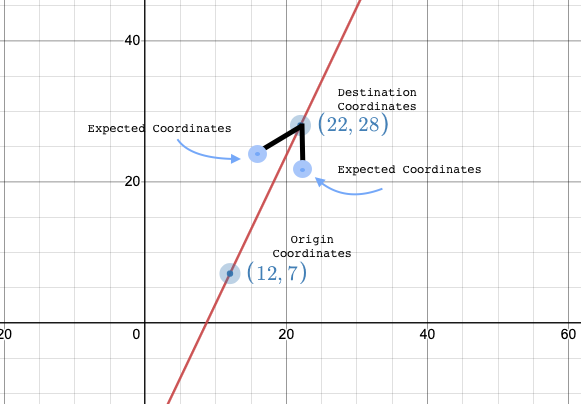
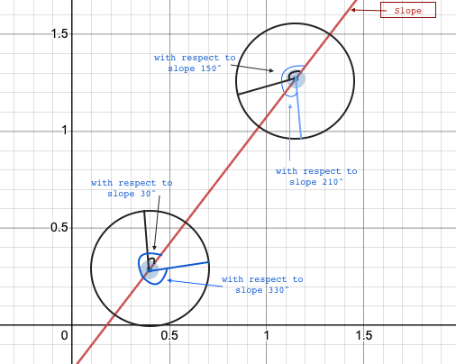
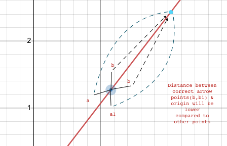

<h1> Introduction </h1>

ArrowHeadPointers is a function that takes two parameters Origin (graph coordinates) and destination (graph coordinates) and outputs two pairs of graph coordinates to build an arrow



<h3>Problem Statement: To calculate the Expected Coordinates of Left and right flanks of the arrow</h3>

```javascript
originCordinates = { x: 12, y: 7 };
destinationCordinates = { x: 22, y: 28 };

Output = [
  [[originCordinates, destinationCordinates]],
  [[destinationCordinates, '{"x":??,"y":??}']],
  [[destinationCordinates, '{"x":??,"y":??}']],
];
```

<h4>For this example Output looks like <h4>

```javascript
[
  [
    { x: 12, y: 7 },
    { x: 22, y: 28 },
  ],
  [
    { x: 22, y: 28 },
    { x: 16.25, y: 24.04 },
  ],
  [
    { x: 22, y: 28 },
    { x: 22.55, y: 21.04 },
  ],
];
```

<h2>Approach </h2>

Assumptions

- The length of the arrow flanks is <b>30%</b> of the total distance between origin and destination
- The angle between the Arrow flanks and the Arrow line (from origin to destination) is 30 degrees
- The direction of arrow is not provided, so assumed it can be any direction based on the coordinates provided
- Assumed 4 possible angle Theta for calculating the cordinates



<h2>Solution</h2>

- Formula used to calculate the X & Y coordinates

> For x = destination x coordinate + radius * Cos(theta)  
> For y = destination y coordinate + radius * Sin(theta)

- For this calculation radius is the length of arrow flank, and Theta is the 4 possible angle values described above. This gives us 4 possibilities for X and Y coordinates



- Finally, comparing the distance from the points to the origin will inform which are the corect coordinates as per the origin coordinates provided.
